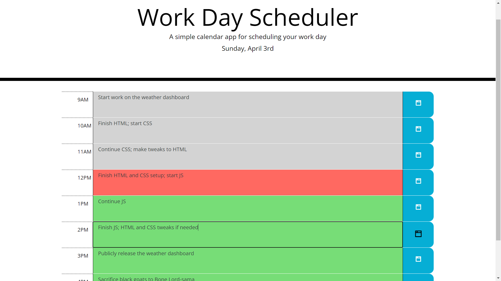

# Work Day Scheduler

## Purpose
This work day scheduler features nine rows for each hour of the average work day. Text can be entered into each row and can be saved by clicking the respective button on the right. Each row also changes its color depending on if the hour has already passed or is currently passing.

Well, it *could* save and it *could* change color if I implemented the JS for it.

## Website
https://jec6789.github.io/work-day-scheduler/

## Contributors
* HTML and CSS by Xandromus
* Additional HTML by JEC6789
